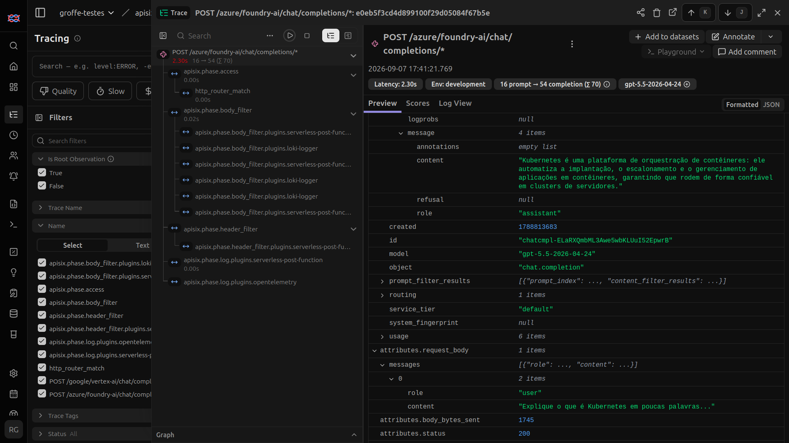
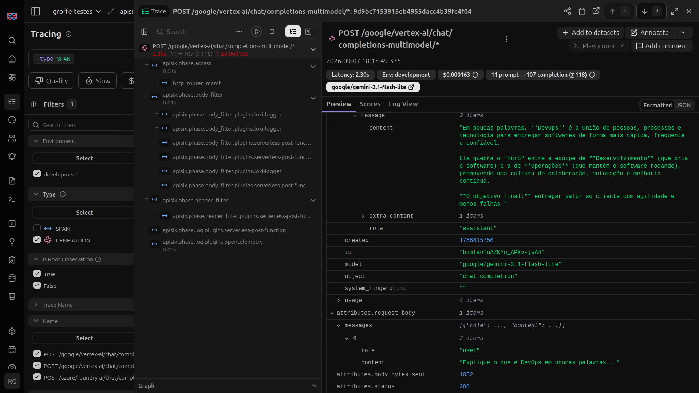

# apisix-ai-gateway-foundry-vertex-otel-langfuse-grafana-prometheus-dockercompose
Scripts do Docker Compose para subida de um ambiente do APISIX com capacidades de AI Gateway. Inclui monitoramento com OpenTelemetry + Grafana + Prometheus + Langfuse, com coleta de traces, métricas e logs. IAs testadas: Microsoft Foundry e Google Vertex.

## Testes

Testes com Microsoft Foundry - (utilizando gpt-5.5 como modelo e um ai-proxy):

Testes com Gemini Enterprise Agent Platform/Vertex - (utilizando google/gemini-3.5-flash-lite como modelo e um ai-proxy-multi):

Testes com Gemini Enterprise Agent Platform/Vertex - (utilizando google/gemini-3.1-flash-lite como modelo e um ai-proxy-multi):

